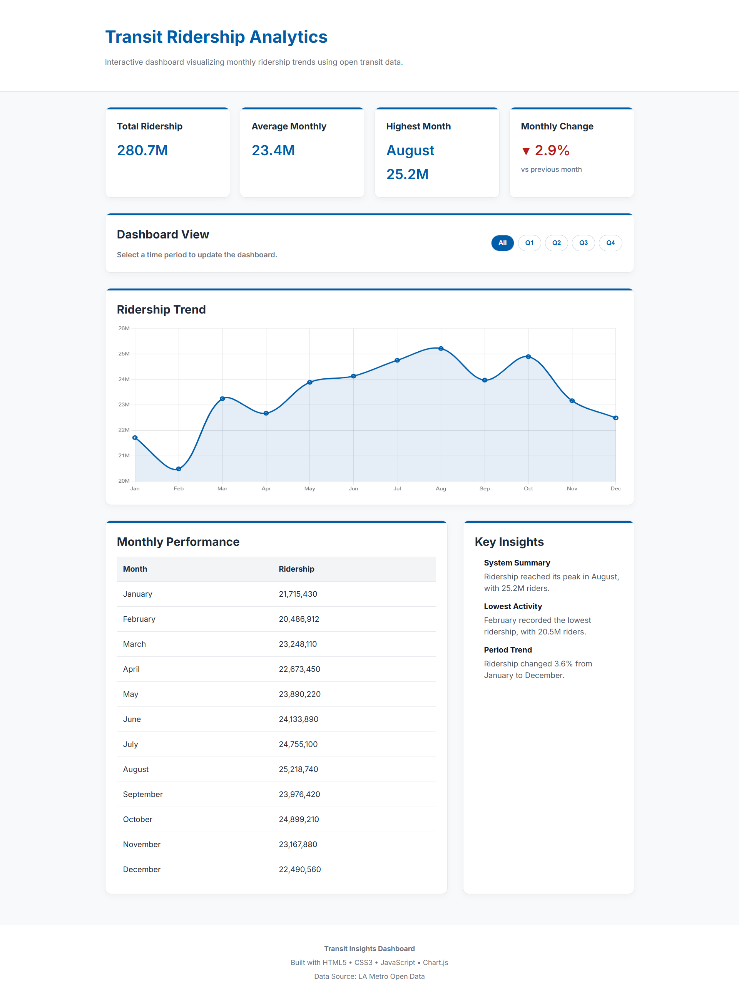

# Transit Insights Dashboard

Transit Insights Dashboard is a responsive frontend dashboard that visualizes monthly LA Metro ridership trends using HTML, CSS, JavaScript, and Chart.js.

I wanted to build a dashboard that focused on presenting real data in a clear, interactive way while practicing responsive layouts, dynamic charts, and user-friendly filtering.

## Live Demo

[View Live Demo](https://frejya-dev.github.io/transit-insights-dashboard/)

## Features

- Interactive ridership trend visualization with Chart.js
- Quarter filters (Q1, Q2, Q3, Q4)
- Dynamic KPI cards
- Monthly performance table
- Automatically generated insights
- Responsive dashboard layout
- Data loaded from a local JSON file

## Built With

- HTML5
- CSS3
- JavaScript (ES6)
- Chart.js
- JSON

## Why I Built This

This project gave me an opportunity to practice building a larger frontend interface using vanilla JavaScript. I focused on organizing data, updating the dashboard dynamically, and presenting information in a way that's easy to explore.

## Skills Practiced

- DOM manipulation
- Working with JSON data
- Interactive filtering
- Data visualization with Chart.js
- Responsive layouts with CSS
- Reusable JavaScript functions

---

Monthly ridership data is based on LA Metro Open Data.

Built by **Frejya Lindh** as part of my frontend development portfolio.
